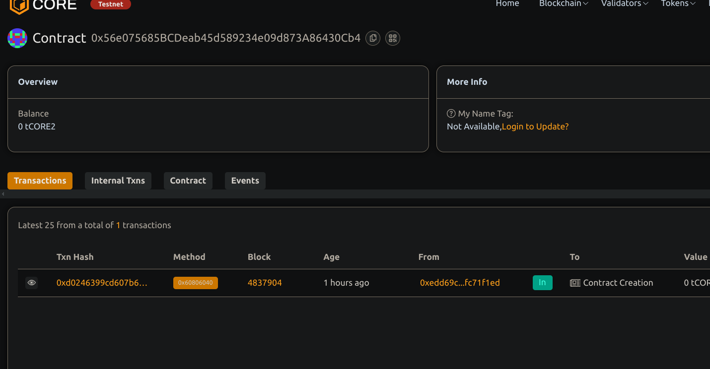

# NFT Fractionalization Protocol

## Project Description
This smart contract allows an NFT owner to lock an ERC721 token within the contract and mint ERC20 tokens that represent fractional ownership of the NFT. These fractional tokens can be freely traded. The full NFT can only be redeemed by a user who holds **100% of the fractional tokens** and burns them.This ensures only a sole holder can reclaim full ownership of the original NFT.

## Project Vision

## Project Vision 

To unlock liquidity for NFTs by enabling fractional ownership, allowing broader access and trading of high-value NFTs.

## Key Features

- NFT Locking : The smart contract allows NFT owners to lock their NFTs inside the contract.
- Document ERC20 fractional token minting feature
- Redeem the NFT by burning all fractional tokens
- Uses OpenZeppelin standards for ERC721 and ERC20 compatibility
- Ownership control for fractionalization

## Future Scope

🛒 Marketplace Integration

Allow listing and trading of fractional tokens on decentralized marketplaces.

📦 Batch Fractionalization

Support locking and fractionalizing multiple NFTs in one transaction.

🗳️ Governance Features

Add DAO-like voting mechanisms for fractional token holders.

⚡ Layer 2 Integration

Enable cheaper and faster transactions via L2 solutions like Arbitrum or Optimism.

## Deployment Instructions for smart contract setup
1. Update `nftAddress` and `nftTokenId` in `deploy.js` with your NFT details.
2. Install dependencies and deploy:

```bash
npm install
npx hardhat compile
npx hardhat run scripts/deploy.js --network core_testnet_2
```

## Contract details
0x56e075685BCDeab45d589234e09d873A86430Cb4
